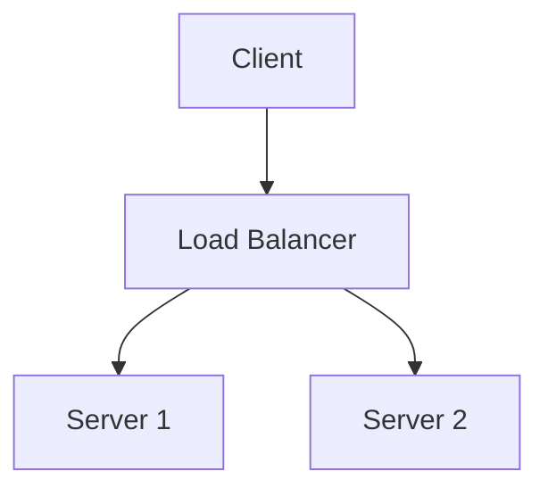

# Output Templates and Multi-Format Rules

Covers the format-agnostic writing rules, the **Feynman concept-block template**
(the core of `revision-notes.md`), and the optional **`quick-reference.md`
cheat-sheet template**.

## Format-agnostic writing rules

The revision notes must render correctly in three contexts: Markdown viewers, PDF conversion, and plain text reading. Follow these rules to ensure compatibility.

### Headings

Use ATX-style headings (`#`, `##`, `###`). Maximum depth: 4 levels.
Always leave a blank line before and after headings.

```markdown
## Lecture 1: Introduction

### 1.1 What is an Operating System?
```

### Formulas

Use LaTeX wrapped in `$...$` (inline) or `$$...$$` (display block).

For PDF conversion compatibility, avoid overly complex LaTeX that requires special packages. Stick to standard math notation.

```markdown
The time complexity is $O(n \log n)$.

$$
P(A|B) = \frac{P(B|A) \cdot P(A)}{P(B)}
$$
```

For plain text fallback: after each formula block, optionally include a plain-language description:
```markdown
$$E = mc^2$$
(Energy equals mass times the speed of light squared)
```

### Code blocks

Always specify the language for syntax highlighting:

````markdown
```python
def binary_search(arr, target):
    lo, hi = 0, len(arr) - 1
    while lo <= hi:
        mid = (lo + hi) // 2
        if arr[mid] == target:
            return mid
        elif arr[mid] < target:
            lo = mid + 1
        else:
            hi = mid - 1
    return -1
```
````

For long code blocks (>30 lines), add a brief comment header explaining what the code does.

### Tables

Use standard Markdown tables. Keep columns reasonably narrow for PDF rendering.

```markdown
| Algorithm | Time (avg) | Time (worst) | Space | Stable? |
|-----------|-----------|-------------|-------|---------|
| Quicksort | O(n log n) | O(n^2) | O(log n) | No |
| Mergesort | O(n log n) | O(n log n) | O(n) | Yes |
```

For tables wider than 5 columns, consider splitting into multiple tables or using a description list format instead.

### Diagrams and figures

Since we're targeting text-based formats, represent diagrams as:

1. **ASCII art** for simple structures (trees, linked lists):
```
    [Root]
   /      \
[Left]  [Right]
```

2. **Mermaid code blocks** for complex flows (supported by many Markdown renderers):


3. **Textual description** as fallback: "Figure: A directed graph with nodes A, B, C where A points to B and C, and B points to C. This represents..."

Always provide the textual description even when including Mermaid/ASCII art — it ensures plain text readability.

### Cross-references

Use relative section references, not Markdown-specific link anchors:

Good: "See Section 3.2 (Lecture 3, Process Scheduling) for details."
Avoid: "See [here](#32-process-scheduling)." (anchor links may break in PDF)

### Emphasis

Use **bold** for key terms on first definition. Use *italic* for emphasis.
Do NOT use bold for entire paragraphs or sentences — it loses its signal value.

### Page breaks (PDF-aware)

When the content logically separates (e.g., between lectures), insert a horizontal rule:
```markdown
---
```
This renders as a visual break in Markdown and can be mapped to a page break in PDF conversion.

## The Feynman concept block template (Phase 2 — the core)

Every concept in `revision-notes.md` follows this block, in this order. The
**plain-language capsule is FIRST** — never lead with the formal definition. A
worked example is **mandatory** for every non-trivial concept (pure-definition
escape hatch in `phase-distill.md`). Full depth-calibration rules live in
`phase-distill.md`; this is the shape.

```markdown
### [Concept Name] ([source location])

**Explain it simply:** [Plain-language capsule, no jargon — one short paragraph. FIRST.]

**Intuition:** [Why it exists / what problem it solves; an analogy if it helps.]

**Formal treatment:**
[$LaTeX$ formula or code block; every symbol/variable defined.]

**Worked example:**
[Concrete, step-by-step — numbers plugged in / algorithm traced. Mandatory for
non-trivial concepts. Pure-definition term → capsule + "Definitional — no worked
example applies", never a fake example.]

**Connections & misconception:** [Prerequisites + what this enables; cross-topic
bridge where useful; one thing students commonly get wrong.]
```

Trivial topics get **capsule + a one-liner only** — present (completeness) but
not padded into the full block.

## Revision-notes document structure

```markdown
# [Course Name] — Revision Notes

> Sources: [N lecture PDFs / topic list / standard syllabus]. Language: [...].
> Last updated: [date].

## About these notes
[What they cover, structure, sources.]

---

## Lecture 1 / Module 1: [Title]

### 1.1 [Topic] (Lecture 1, pp. X-Y)
[Feynman concept block — see template above]

### 1.2 [Topic] (Lecture 1, pp. Y-Z)
[...]

> **Bridge:** [Transition / connection to the next concept or lecture]

---

## Lecture 2: [Title]
[...]

---

## Coverage reconciliation
[Filled in Phase 2 Step 4: all checklist topics present ✓; any filled-on-reconcile;
any flagged uncoverable/uncertain. See phase-distill.md.]
```

## The quick-reference.md cheat-sheet template (OPTIONAL)

Produced only if the user asks. **One line per entry**, ordered by **exam
relevance** (most likely to appear first), NOT lecture order, NOT prose
paragraphs. Source refs omitted here (speed over traceability in this lookup
sheet). Priority topics from Phase 0 go first.

```markdown
# Quick Reference: [Course Name]

## Formulas (most exam-relevant first)
| Name | Formula | When to use / key constraint |
|------|---------|------------------------------|
| [Name] | $[LaTeX]$ | [one line] |

## Key definitions
- **[Term]:** [one sentence]

## Algorithms
| Name | Time | Space | Key idea |
|------|------|-------|----------|
| [Name] | O(?) | O(?) | [one line] |

## Common traps
- [The specific mistake + the correct behaviour — one line]

## Easily-confused pairs
| A vs B | Distinguishing point |
|--------|----------------------|
| [X vs Y] | [one line] |
```

There is **no exam-Q&A bank** — that product was cut in v3.0. The cheat sheet is
the only optional companion to the notes.

## Format-specific conversion notes

### Markdown (.md)
Primary output format. No special handling needed if the rules above are followed.

### PDF conversion

When converting to PDF, read `rules/pdf-export.md` for font configuration, pandoc commands, and CJK/bilingual document handling. Convert with pandoc/xelatex per `rules/pdf-export.md`. (Reading input course PDFs is a separate job that goes through the `/pdf` skill — see Global Rule #1.)

---

### Plain text readability
The document must be readable with all Markdown stripped:
- Headings are recognizable by their `#` prefixes
- Formulas have plain-language descriptions nearby
- Code is in fenced blocks
- No meaning carried solely by formatting — don't use bold as the only signal for key terms; also use "Key term: …" phrasing
