<p align="center">
  
</p>

<h1 align="center">ERPClaw</h1>

<p align="center">
  <em>The AI-native ERP. Chat with your books.</em>
</p>

<p align="center">
  
  <!-- version badge is static; bump at each release publish -->
  
  
  
  <a href="https://www.erpclaw.ai"></a>
  
</p>

<p align="center">
  
</p>

**ERPClaw runs your whole business from plain English.** Tell it "invoice Wayne
Industries for 10 widgets at $100" and it writes the invoice, posts the
balanced journal entries, and replies with the invoice number. Record a payment,
close the month, pull a P&L by department, run payroll, the assistant you
already use does the work and the books stay audit-grade underneath. No forms to
click through, no screens to learn, no per-seat bill. It is open source, it is
free forever, and it runs on your own machine so your data never leaves it.

The difference from every other "AI" accounting tool is structural: ERPClaw was
built AI-native from the first commit, with the assistant as the primary
interface and the accounting rules as auditable code. That is not a chat sidebar
bolted onto a forms app, and it is not something a legacy product can retrofit.

<sub>The rest of this README is the technical reference for installing and
running the foundation. If you just want the product overview, see
<a href="https://www.erpclaw.ai">erpclaw.ai</a>.</sub>

## Quick start

ERPClaw is one product. You install it once, then describe your business and it
sets itself up.

```
clawhub install erpclaw
```

This installs the foundation and initializes the database. From there you just
talk to your AI assistant:

```
"I'm opening a retail store called Sunrise Goods in Portland, Oregon. Set me up."
→ creates your company, a US GAAP chart of accounts, fiscal year, and tax rates
```

Industry coverage comes the same way, with no second install command:

```
"I'm a school"           → ERPClaw pulls the education vertical and creates its tables
"I need manufacturing"   → pulls Manufacturing, Projects, Assets, Quality, Support
"Set me up for a clinic" → pulls clinical practice management
```

Vertical code lives on GitHub and is fetched on demand by sparse checkout, so
only the module you asked for is downloaded. You never run another install
command and never have to know what a module is.

## What it covers

One install, one shared database, every major business function:

- **Accounting**: double-entry general ledger, US GAAP chart of accounts,
  immutable journal entries, multi-company, multi-currency
- **Sales & buying**: customers, suppliers, orders, delivery notes, invoices,
  credit notes, goods received notes
- **Inventory**: items, warehouses, stock moves, serial and batch tracking,
  reorder levels, valuation
- **Payments & billing**: payment entries, bank reconciliation, usage-based
  billing, recurring invoices, subscriptions
- **Tax & payroll**: tax templates and returns, salary structures, FICA,
  federal and state withholding, W-2s, garnishments
- **Advanced accounting**: ASC 606 revenue recognition, ASC 842 leases,
  intercompany transactions, consolidation
- **Reporting**: trial balance, P&L, balance sheet, cash flow, AR/AP aging
- **Industries**: retail, healthcare, education, property, construction,
  agriculture, automotive, food, hospitality, legal, nonprofit, plus regional
  tax packs for Canada, the UK, India, and the EU
- **Deep integrations**: Stripe and Shopify sync straight into your general
  ledger, free and self-hosted, with ASC 606 revenue recognition built in

## Runs your way

- **SQLite by default, PostgreSQL fully supported.** The same code runs on
  either through a query-builder abstraction. SQLite needs zero setup; point it
  at PostgreSQL when you outgrow a single file.
- **Self-hosted.** The database lives at `~/.openclaw/erpclaw/data.sqlite` on
  your own machine. Your books never leave your infrastructure.
- **$0 forever.** GPL v3, open source, no freemium tier, no per-seat pricing.

### Built to be trusted with money

- All financial amounts stored as TEXT (Python `Decimal`), never float
- IDs are UUID4 (TEXT)
- GL entries are immutable; a cancellation posts reversing entries, never an edit
- Every cross-table write happens in a single transaction
- Every posting passes the full GL invariant validation before it commits

## Reference

The foundation routes every operation through one entry point,
`scripts/db_query.py --action {action} --args`, across 14 user-facing accounting
domains (`setup`, `gl`, `selling`, `buying`, `inventory`, `billing`, `tax`,
`payments`, `journals`, `reports`, `hr`, `payroll`, `accounting-adv`) plus
`meta` and `os` infrastructure. The module registry
(`scripts/module_registry.json`) tracks every additional module across the
`github.com/avansaber/*` repos and installs them on demand by sparse checkout.

Module authoring and DGM evolution (code generation, sandboxed test runs, the
deploy pipeline) live in the optional
[`erpclaw-os-engine`](https://github.com/avansaber/erpclaw-addons/tree/main/erpclaw-os-engine)
addon, which is not installed by default. The foundation runs no
module-generation or auto-deploy code paths.

<sub>Current build:
<!-- SYNC:facts:start -->
ERPClaw v4.11.0 | 46 modules (46 active + 0 preview) | 3,169 actions
<!-- SYNC:facts:end -->
</sub>

## Web dashboard

The primary interface is the AI assistant, but two optional dashboards exist:

- **[ERPClaw Web](https://github.com/avansaber/erpclaw-web)**: purpose-built
  dashboard with live data tables, action execution, AI chat, and real-time
  updates.
- **[WebClaw](https://github.com/avansaber/webclaw)**: universal OpenClaw
  dashboard that reads ERPClaw's SKILL.md and generates forms, tables, and
  charts with zero per-skill setup (`clawhub install webclaw`).

## Links

- **Website:** [erpclaw.ai](https://www.erpclaw.ai)
- **Stripe Marketplace:** [marketplace.stripe.com/apps/erpclaw-accounting](https://marketplace.stripe.com/apps/erpclaw-accounting)
- **Docs:** [erpclaw.ai/docs](https://www.erpclaw.ai/docs)
- **All modules:** [github.com/avansaber](https://github.com/avansaber)
- **OpenClaw:** [openclaw.org](https://openclaw.org)

## License

GNU General Public License v3. Copyright © 2026 AvanSaber Inc.

See [LICENSE.txt](LICENSE.txt) for details.
