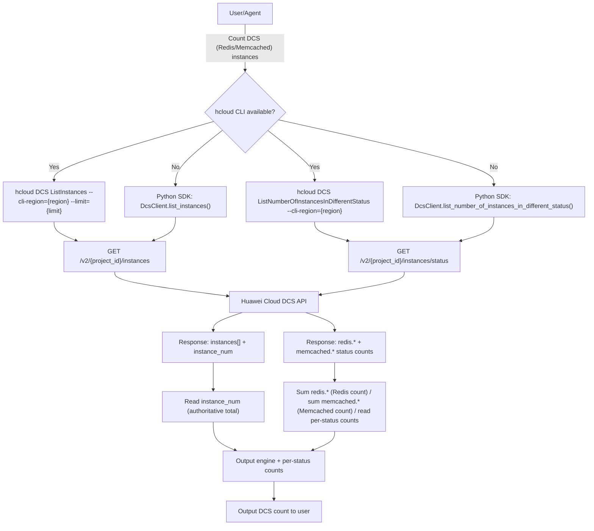

# Data Flow Diagram

## API Endpoint

| Item | Value |
|------|-------|
| Method | `GET` |
| Path | `/v2/{project_id}/instances` (ListInstances) |
| Path | `/v2/{project_id}/instances/status` (ListNumberOfInstancesInDifferentStatus) |
| SDK method | `list_instances`, `list_number_of_instances_in_different_status` (huaweicloudsdkdcs v2) |
| Source | SDK `_list_instances_http_info` / `_list_number_of_instances_in_different_status_http_info` resource_path |
