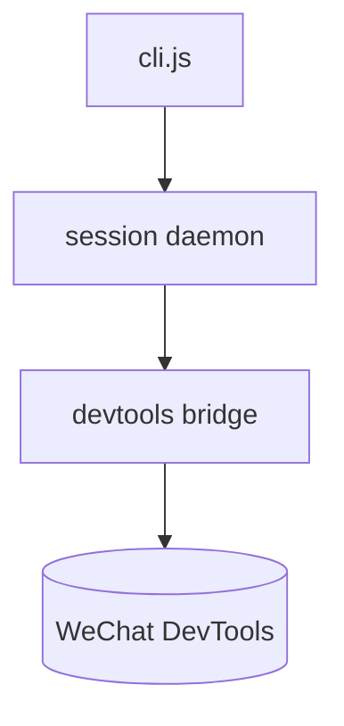
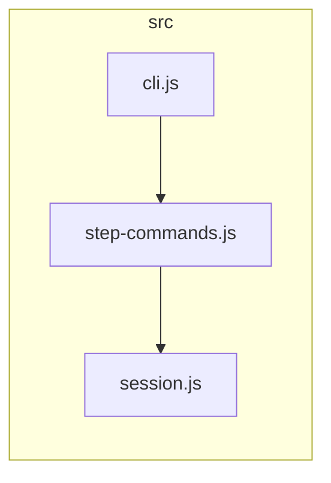

# Contract format (what the gate parses)

The three artifacts are human-facing Markdown. Only `interfaces.md` has a **strict,
gate-parseable** shape — `scripts/verify_contracts.mjs` reads it. `architecture.md`
and `structure.md` are prose + Mermaid; the gate does not parse them, the
fresh-reader pass checks them.

## `interfaces.md` — gate-parseable

A `## Public interface` table, one row per public symbol, exactly three columns:

```markdown
## Public interface

| Symbol | Signature | Source |
|---|---|---|
| `parseConfig` | `parseConfig(text: string): Config` | `src/config.js:12` |
| `loadEnv`     | `loadEnv(): Env`                     | `src/env.js:5`    |
```

- **Symbol** — the exact public identifier, backticked. Matched by exact name (so
  `id` is never confused with `uuid`/`idx`).
- **Signature** — human-facing; the gate does not check it (the fresh-reader pass
  does). Keep it real.
- **Source** — `path:line`, backticked, **relative to the project root** (or to the
  `--scope` dir), pointing at the definition line. The gate fails if the symbol is
  not defined there.

### Intentionally-internal exclusions

A symbol the extractor sees as public-looking but that is deliberately **not** part
of the contract goes under:

```markdown
## Intentionally internal (excluded from coverage)

- `legacyShim` — kept for one release; not a supported interface
- `debugDump`  — diagnostics only
```

Rules the gate enforces (see `references/gate-design.md`):
- You **cannot** exclude a symbol the code *clearly exports* (`export function …`,
  `module.exports.x`, top-level `def`/`class`, exported Go func, `public` member) —
  that is a `CONTRADICTION`. Exclusions are only for weak/ambiguous surface.
- You **cannot** exclude more than half the surface — that trips
  `EXCESSIVE_EXCLUSIONS`. Document interfaces; don't hide them.
- A symbol whose name starts with `_` is treated as private by convention and is
  never part of the surface, so it needs no exclusion.

## `architecture.md` — Mermaid conventions

Lead with a `flowchart`/`graph` of components and their dependencies, then prose:

```markdown
# Architecture



## Components
- **cli.js** — argument parsing + command dispatch. Owns: …
…
## Boundaries
- The bridge is the only component that talks to DevTools; …
```

## `structure.md` — Mermaid + module map

A diagram of how files/modules are organized, then a table:

```markdown
# Structure



| Module | Responsibility | Depends on |
|---|---|---|
| `src/cli.js` | entry + dispatch | `step-commands.js` |
…
```

Keep diagrams **diffable** (Mermaid text, not images) so the contract reviews like
code.
